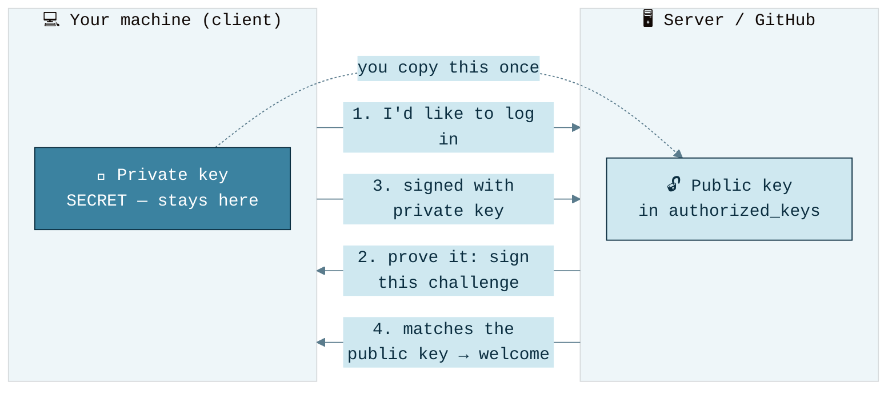

# 0 — SSH

> The first real step in any setup. SSH is how you log into remote machines, push to GitHub, copy files, and tunnel ports — all **without typing a password**, using cryptographic keys. This chapter explains what SSH *is*, the words you'll keep hearing, and exactly how to generate keys and wire up passwordless connections to servers and GitHub.

> [!IMPORTANT]
> The one idea to hold onto: SSH uses a **pair of keys** — a **private** one that *never leaves your machine* and a **public** one you hand out freely. You put your public key on a server (or GitHub); the server then trusts anyone holding the matching private key. No passwords travel over the wire. Think of private key as `key` and public key as a `lock`. So after setup, the concept is equivalent to "who has `key` for `lock` to enter this server?". 

---

## Setup — the 5-minute version

```bash
# 1. Generate a modern key pair (press Enter for default path; set a passphrase)
ssh-keygen -t ed25519 -C "your_email@example.com"

# 2. Start the agent and add your key (so you type the passphrase once per session)
eval "$(ssh-agent -s)"
ssh-add ~/.ssh/id_ed25519          # macOS: ssh-add --apple-use-keychain ~/.ssh/id_ed25519

# 3a. Put the PUBLIC key on a server you can already log into
ssh-copy-id user@server.example.com
ssh user@server.example.com        # now logs in with no password

# 3b. …or paste the PUBLIC key into GitHub → Settings → SSH and GPG keys
pbcopy < ~/.ssh/id_ed25519.pub     # macOS (Linux: xclip -sel clip < ...)
ssh -T git@github.com              # test: "Hi <user>! You've successfully authenticated"
```

The rest of this chapter explains *why* each step works and how to make it convenient.

---

## §1 — What is SSH, and where is it used?

**SSH** (Secure Shell) is a protocol for talking to another computer over an encrypted connection. Anything sensitive — your commands, files, passwords — is scrambled in transit so nobody on the network can read it.

You will use SSH constantly, often without realizing it:

| Use case | What it looks like |
|----------|--------------------|
| **Log into a remote machine** | `ssh user@1.2.3.4` — get a shell on a server, a cloud VM, a GPU box, a Raspberry Pi. |
| **Push/pull with GitHub, GitLab** | `git clone git@github.com:me/repo.git` — Git uses SSH to authenticate you, no password prompts. |
| **Copy files** | `scp file.txt user@host:~/` or `rsync` — move data to/from servers securely. |
| **Edit code remotely** | VS Code **Remote-SSH** opens a folder *on the server* and edits it as if local (huge for ML on cloud GPUs). |
| **Tunnel a port** | View a remote Jupyter/TensorBoard on `localhost` through an encrypted tunnel. |
| **Run a command remotely** | `ssh host "nvidia-smi"` — run one command and get the output back. |

> [!TIP]
> If you do ML in the cloud, SSH is the backbone of your day: you SSH into a GPU instance, your editor connects over SSH, your data moves over SSH (rsync/scp), and your GitHub access *is* SSH. Getting this right once pays off forever.

---

## §2 — Nomenclature (the words that keep coming up)

| Term | What it means |
|------|---------------|
| **Client** | Your machine — the one initiating the connection (`ssh ...`). |
| **Server / host** | The machine you're connecting *to* (it runs an SSH daemon, `sshd`). |
| **Key pair** | Two mathematically linked files generated together. |
| **Private key** | `~/.ssh/id_ed25519` — **secret, never share, never leaves your machine.** Proves who you are. |
| **Public key** | `~/.ssh/id_ed25519.pub` — safe to share. You copy this *onto* servers and GitHub. |
| **Passphrase** | An optional password that encrypts your *private key file* on disk, so a stolen laptop ≠ stolen identity. Different from a login password. |
| **`ssh-agent`** | A small background program that holds your *unlocked* private key in memory, so you type the passphrase once per session instead of every connection. |
| **`authorized_keys`** | A file *on the server* (`~/.ssh/authorized_keys`) listing the public keys allowed to log in as that user. |
| **`known_hosts`** | A file *on your machine* (`~/.ssh/known_hosts`) remembering the fingerprints of servers you've trusted, so you're warned if one changes. |
| **Fingerprint** | A short hash of a key used to eyeball-verify identity (the `SHA256:...` string on first connect). |
| **`~/.ssh/config`** | Your personal address book of shortcuts — aliases, usernames, keys, and options per host. |

---

## §3 — How key-based login works (the 60-second version)

You don't need the math. The intuition is a lock-and-key:



- The **public key** is a padlock you give out. The **private key** is the only key that opens it.
- The server can *verify* your signature using the public key, but **can't reverse it** to learn your private key.
- This is why pasting your `.pub` into GitHub or a server is safe, and why your private key must never be shared or committed to git.

---

## §4 — Creating your keys

Use **Ed25519** — it's modern, fast, and short. (RSA still works; only use `-t rsa -b 4096` for ancient servers that reject Ed25519.)

```bash
ssh-keygen -t ed25519 -C "your_email@example.com"
```

You'll be asked three things:

| Prompt | What to do |
|--------|-----------|
| **File location** | Press Enter for the default `~/.ssh/id_ed25519`. (Name it explicitly if you'll have several — see §8.) |
| **Passphrase** | **Set one.** It encrypts the private key on disk. The `ssh-agent` means you only type it once per session, so there's little downside. |
| Confirm passphrase | Re-type it. |

This produces two files:

```text
~/.ssh/id_ed25519        ← PRIVATE  (chmod 600, never share)
~/.ssh/id_ed25519.pub    ← PUBLIC   (this is the one you distribute)
```

> [!WARNING]
> SSH is strict about file permissions and **will refuse to use keys that are too open.** If logins silently fail, fix permissions first:
> ```bash
> chmod 700 ~/.ssh
> chmod 600 ~/.ssh/id_ed25519        # private key: owner read/write only
> chmod 644 ~/.ssh/id_ed25519.pub    # public key
> ```

### Load the key into the agent

```bash
eval "$(ssh-agent -s)"               # start the agent (if not already running)
ssh-add ~/.ssh/id_ed25519            # unlock once, cached for the session
```

On **macOS**, store the passphrase in the Keychain so it's remembered across reboots:

```bash
ssh-add --apple-use-keychain ~/.ssh/id_ed25519
```
And add this to `~/.ssh/config` so the agent + keychain are used automatically:
```sshconfig
Host *
    AddKeysToAgent yes
    UseKeychain yes
    IdentityFile ~/.ssh/id_ed25519
```

---

## §5 — Connecting to a server (passwordless)

The whole point: get your **public** key into the server's `~/.ssh/authorized_keys`. Easiest way, if you can already log in with a password:

```bash
ssh-copy-id user@server.example.com    # appends your .pub to authorized_keys for you
ssh user@server.example.com            # done — no password from now on
```

No `ssh-copy-id` (e.g. on a fresh Windows/minimal box)? Do it by hand:

```bash
# print your public key, copy it
cat ~/.ssh/id_ed25519.pub

# on the server:
mkdir -p ~/.ssh && chmod 700 ~/.ssh
echo "ssh-ed25519 AAAA...your-key... you@example.com" >> ~/.ssh/authorized_keys
chmod 600 ~/.ssh/authorized_keys
```

> [!NOTE]
> **First connection asks you to trust the server** ("The authenticity of host ... can't be established... fingerprint SHA256:..."). Type `yes`. This stores the server's fingerprint in your `known_hosts`. If you later see a *scary* "REMOTE HOST IDENTIFICATION HAS CHANGED" warning, it usually means the server was rebuilt (or, rarely, someone's intercepting) — verify before clearing it with `ssh-keygen -R hostname`.

---

## §6 — Connecting to GitHub (and GitLab, etc.)

Git over SSH means no username/password (or token) on every push.

1. **Copy your public key:**
   ```bash
   pbcopy < ~/.ssh/id_ed25519.pub        # macOS
   xclip -sel clip < ~/.ssh/id_ed25519.pub   # Linux
   ```
2. **Add it on GitHub:** Settings → **SSH and GPG keys** → *New SSH key* → paste → save.
3. **Test:**
   ```bash
   ssh -T git@github.com
   # → "Hi <username>! You've successfully authenticated, but GitHub does not provide shell access."
   ```
4. **Use SSH URLs** for repos (not HTTPS):
   ```bash
   git clone git@github.com:user/repo.git
   # convert an existing HTTPS repo:
   git remote set-url origin git@github.com:user/repo.git
   ```

> [!TIP]
> `git@github.com` is real SSH: user `git`, host `github.com`. GitHub maps *which account* you are by *which key* authenticated — that's how a single `git` user serves everyone.

---

## §7 — The `~/.ssh/config` file (your shortcut book)

Stop memorizing IPs, usernames, ports, and key paths. Define them once:

```sshconfig
# A cloud GPU box
Host ml-gpu
    HostName 3.91.22.10
    User ubuntu
    IdentityFile ~/.ssh/id_ed25519
    ServerAliveInterval 60          # keep the connection from dropping when idle

# A server on a non-standard port behind a jump host
Host prod
    HostName 10.0.5.20
    User deploy
    Port 2222
    ProxyJump bastion.example.com   # hop through a gateway automatically

# GitHub (lets you pin a specific key)
Host github.com
    HostName github.com
    User git
    IdentityFile ~/.ssh/id_ed25519
```

Now `ssh ml-gpu` expands to the full command. The same aliases work in `scp`, `rsync`, and VS Code Remote-SSH.

---

## §8 — Multiple keys / multiple accounts (e.g. work + personal GitHub)

A common need: a personal GitHub *and* a work GitHub, each requiring a distinct key. Make two keys, then disambiguate with host aliases:

```bash
ssh-keygen -t ed25519 -C "personal" -f ~/.ssh/id_personal
ssh-keygen -t ed25519 -C "work"     -f ~/.ssh/id_work
```

```sshconfig
# ~/.ssh/config
Host github-personal
    HostName github.com
    User git
    IdentityFile ~/.ssh/id_personal
    IdentitiesOnly yes              # force THIS key only, don't offer others

Host github-work
    HostName github.com
    User git
    IdentityFile ~/.ssh/id_work
    IdentitiesOnly yes
```

Then clone using the alias as the host:

```bash
git clone git@github-personal:me/sideproject.git
git clone git@github-work:org/service.git
```

---

## §9 — Beyond login: files and tunnels

```bash
# Copy a file to / from a server (host alias from ~/.ssh/config works here too)
scp model.pt ml-gpu:~/checkpoints/
scp ml-gpu:~/results/metrics.csv ./

# rsync — incremental, resumable, the right tool for big datasets
rsync -avzP ./data/ ml-gpu:~/data/      # only sends what changed; shows progress

# Run a single remote command
ssh ml-gpu "nvidia-smi"

# Port forwarding — view a remote Jupyter / TensorBoard locally
ssh -L 8888:localhost:8888 ml-gpu       # then open http://localhost:8888 in your browser
ssh -L 6006:localhost:6006 ml-gpu       # TensorBoard on :6006
```

> [!TIP]
> **Local port forwarding** (`-L`) is the clean way to reach a notebook or dashboard running on a GPU box without exposing it to the internet — the traffic rides your existing encrypted SSH tunnel.

---

## §10 — Hardening (for servers you administer)

If you run the server, lock it down once keys work. Edit `/etc/ssh/sshd_config`:

```sshconfig
PasswordAuthentication no      # keys only — kills brute-force password attacks
PermitRootLogin no             # no direct root login; use sudo
PubkeyAuthentication yes
```
```bash
sudo systemctl restart ssh     # apply (Debian/Ubuntu; some distros use sshd)
```

> [!CAUTION]
> **Confirm key login works in a second terminal *before* disabling passwords**, or you can lock yourself out. Keep an existing session open as a safety net.

---

## §11 — Troubleshooting

| Symptom | Fix |
|---------|-----|
| `Permission denied (publickey)` | Key not on server / wrong key offered. Check `authorized_keys`, add `IdentitiesOnly yes`, or run `ssh -v` to see which key is tried. |
| Asked for a password despite keys | Public key not in server's `authorized_keys`, or **permissions too open** (re-run the `chmod` from §4). |
| `WARNING: REMOTE HOST IDENTIFICATION HAS CHANGED` | Server was rebuilt → `ssh-keygen -R hostname` to forget the old fingerprint, then reconnect and re-verify. |
| Passphrase prompt every time | Key not in the agent → `ssh-add` it (macOS: `--apple-use-keychain`). |
| Connection drops when idle | Add `ServerAliveInterval 60` to `~/.ssh/config`. |
| "Which key is even being used?" | `ssh -vT git@github.com` — verbose mode prints the whole negotiation. |

---

## TL;DR

- **One key pair, two files:** private stays secret forever; public gets distributed.
- **Generate:** `ssh-keygen -t ed25519 -C "email"`, set a passphrase, `ssh-add` it.
- **Servers:** `ssh-copy-id user@host` → passwordless login.
- **GitHub:** paste `.pub` into Settings → SSH keys → use `git@github.com:...` URLs.
- **`~/.ssh/config`** turns long commands into short aliases and powers `scp`, `rsync`, and VS Code Remote-SSH.
