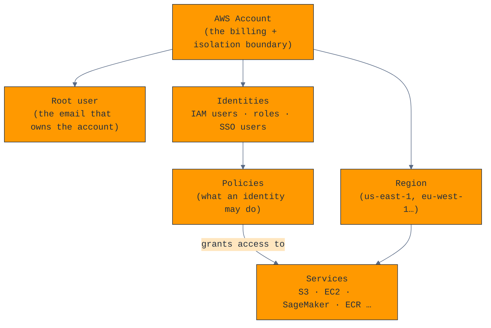
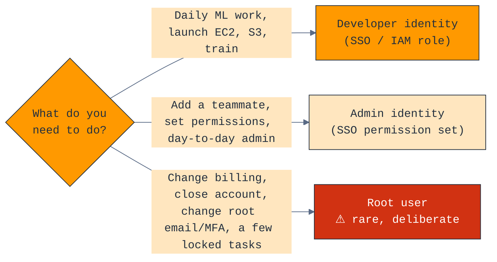
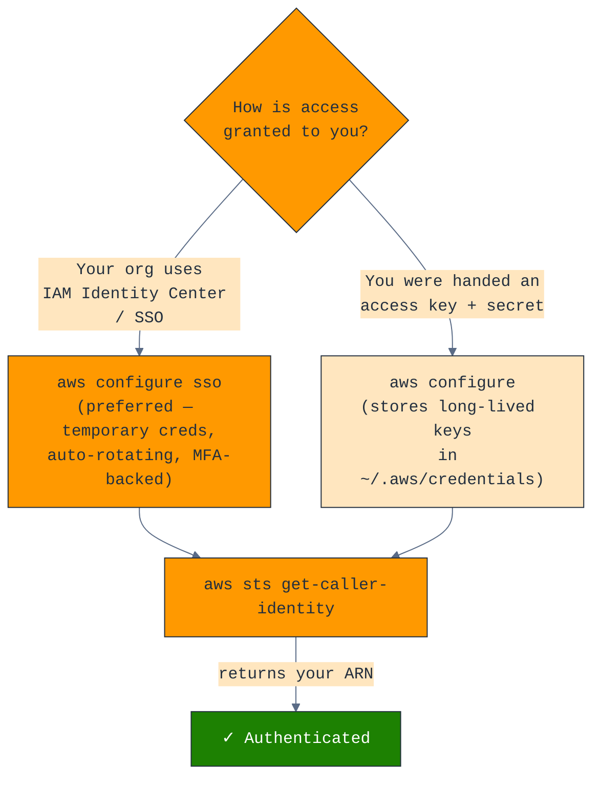
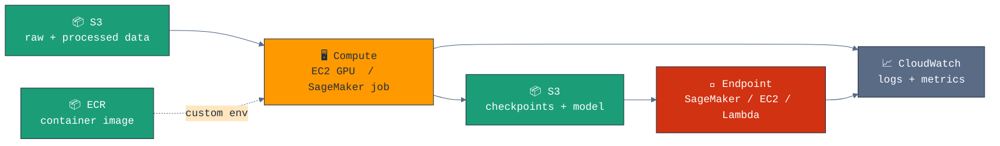
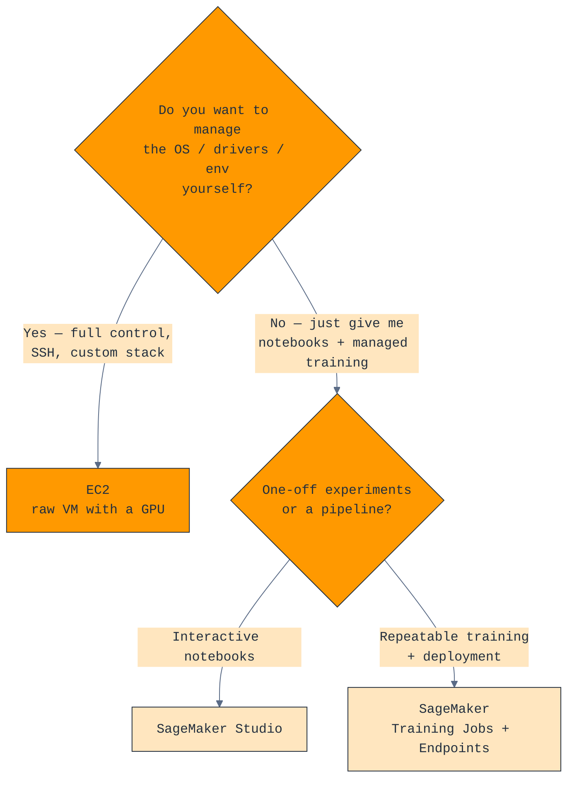
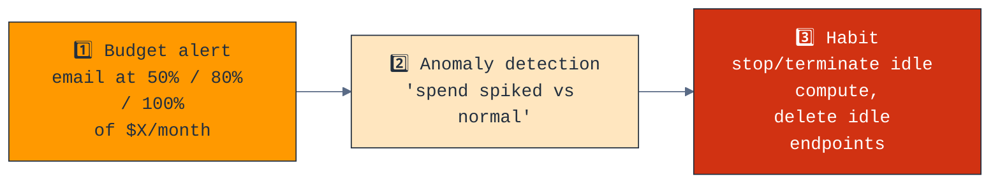

# 10 — AWS

> A practical, no-PhD guide to getting an ML practitioner productive on AWS. Covers the account model (especially if you wear both the **root/manager** hat and a **developer** hat), browser + terminal + VS Code setup, the core services (IAM, S3, EC2, SageMaker, and friends), and the cost discipline that keeps GPU bills sane.

> [!IMPORTANT]
> AWS bills by the second for compute and forever for storage. The single highest-value thing in this whole chapter is the **billing alerts + "stop your instances"** discipline in the [Cost](#cost--the-only-section-you-cant-skip) section. Read that even if you read nothing else.

---

## Setup — the 15-minute checklist

This is the whole chapter compressed. Each item links to the detailed section below.

```text
ACCOUNT (do once, as the account owner)
  [ ] Secure the root user: strong password + hardware/virtual MFA       → §3
  [ ] Stop using root. Create an admin identity in IAM Identity Center   → §3, §4
  [ ] Set a budget + billing alert ($X/month → email)                    → §9
  [ ] Pick a home region and stick to it (e.g. us-east-1, eu-west-1)     → §2

YOUR DEVELOPER IDENTITY (do once per machine)
  [ ] Install AWS CLI v2                                                  → §5
  [ ] aws configure sso   (or aws configure for plain keys)              → §5
  [ ] aws sts get-caller-identity   ← confirms you're authenticated      → §5
  [ ] Install AWS Toolkit in VS Code                                     → §6

ML WORKING SET (as you go)
  [ ] One S3 bucket for data, one for artifacts                          → §7
  [ ] Know how to launch + STOP a GPU EC2 box                            → §8
  [ ] SageMaker Studio if you want managed notebooks/training            → §8
```

---

## §1 — The mental model

Before any commands, here's how the pieces relate. Everything in AWS is "a resource, owned by an account, in a region, accessed by an identity that a policy permits."



Read it as: **an account contains a root user and a set of IAM identities; a policy attached to an identity grants it permission to use services; services live inside regions.**

---

## §2 — Terminology (learn these eight, ignore the other 200)

AWS documentation drowns you in vocabulary. These are the ones that actually matter day-to-day.

| Term | Plain-English meaning | Why you care |
|------|----------------------|--------------|
| **Root user** | The original identity tied to the account's email + credit card. Can do *anything*, including close the account. | You should log in as root **almost never** — see §3. |
| **IAM user** | A named identity with its own password/keys, scoped by policy. | Legacy way to give a human or script access. SSO is now preferred for humans. |
| **IAM role** | A set of permissions that is *assumed temporarily* — no permanent password. EC2 instances, SageMaker, and Lambda "wear" a role. | This is how your code gets permissions **without hard-coded keys**. The single most important security concept. |
| **Policy** | A JSON document listing allowed/denied actions on resources. | Attached to users/roles. "Least privilege" = grant only what's needed. |
| **ARN** | Amazon Resource Name — the globally unique ID of any resource: `arn:aws:s3:::my-bucket`. | You'll paste these into policies and commands constantly. |
| **Region** | A geographic cluster of data centers: `us-east-1`, `eu-west-1`. | Resources are region-scoped. Data in one region isn't visible in another. Latency + price + GPU availability vary. |
| **Availability Zone (AZ)** | An isolated datacenter *within* a region: `us-east-1a`. | For HA you spread across AZs. For ML you mostly just need GPUs to exist in *some* AZ. |
| **VPC** | Your private network inside AWS. Every EC2 instance lives in one. | Mostly handled by defaults; you'll touch it via **security groups** (firewall rules) to open SSH/ports. |

> [!TIP]
> **IAM Identity Center** (formerly "AWS SSO") is the modern front door for humans. **IAM users + access keys** is the old way, still used for service accounts and scripts. When in doubt for *people*, use Identity Center; for *machines*, use roles.

---

## §3 — Account model: wearing two hats

You told me you are **both** the root/account manager for your team **and** a developer with your own working account. This is the most security-sensitive part of your setup, so it gets its own section.

### The golden rule



### As the account manager (root responsibilities — do these once, carefully)

> [!CAUTION]
> The root user can delete everything and run up unlimited bills. Treat its credentials like the deed to your house.

1. **Lock root down.**
   - Set a long, unique password (store in a password manager).
   - **Enable MFA on root** — ideally a hardware key (YubiKey) or a dedicated TOTP app. Console: top-right account menu → *Security credentials* → *Multi-factor authentication*.
   - **Delete any root access keys** if they exist. Root should have *no* programmatic keys, ever.

2. **Create real admin access that isn't root.** Enable **IAM Identity Center**, create a permission set (start with the AWS-managed `AdministratorAccess`), and assign it to yourself. From now on you log in via the Identity Center portal URL, not the root email.

3. **Set the account up for the team:**
   - **Account alias** so the sign-in URL is `myteam.signin.aws.amazon.com` instead of a 12-digit number (IAM → *Dashboard* → *Account Alias*).
   - **Budgets + billing alerts** (see §9) — non-negotiable when teammates can spawn GPUs.
   - **Enable IAM access in the billing console** so non-root admins can see costs (My Account → *IAM User and Role Access to Billing Information* → activate).
   - Consider **AWS Organizations** if your team needs separate accounts (e.g., a sandbox account per person) — strong blast-radius isolation, and you can set **Service Control Policies (SCPs)** to, say, forbid expensive regions or instance types org-wide.

4. **Give teammates least-privilege access** via Identity Center permission sets, not by sharing keys. A good ML-team starting set:
   - `PowerUserAccess` (everything except IAM/account management) for builders.
   - A custom read-only billing view for everyone.

### When you genuinely must use root

Only these tasks *require* root (everything else has an IAM/SSO path):

| Root-only task | How often |
|----------------|-----------|
| Change the account's email, name, or root password | rare |
| Change/remove root MFA | rare |
| Close the AWS account | once, maybe |
| Change AWS Support plan | rare |
| Restore IAM user permissions you accidentally locked yourself out of | emergency |
| Some tax/billing settings | rare |

### As a developer (your daily identity)

Use your **SSO / IAM role**, never root. Your developer identity should have enough to do ML work (S3, EC2, SageMaker, ECR, CloudWatch) but **not** the ability to delete the account or rewrite everyone's permissions. If you need a permission you don't have, that's a *request to your admin hat*, made deliberately — which is exactly the friction that keeps a fat-fingered command from being catastrophic.

> [!TIP]
> Keep the two hats in **two browser profiles** (e.g. Chrome profile "AWS-Admin" and "AWS-Dev") or use the [AWS extend session / Firefox containers] approach. It stops you from doing dev work while logged in as admin out of habit.

---

## §4 — Browser (Console) setup

The web console is best for *first-time setup, exploration, and billing*. Real work moves to the terminal.

| Step | Where | Notes |
|------|-------|-------|
| Enable MFA on root + your user | Account menu → Security credentials | Do this first, always. |
| Turn on IAM Identity Center | Search "IAM Identity Center" | Creates the portal URL you'll bookmark. |
| Set account alias | IAM → Dashboard | Friendly sign-in URL. |
| Create a budget | Billing → Budgets | See §9. |
| Pin your services | Console top bar → ☆ | Pin S3, EC2, SageMaker, CloudWatch, Billing. |
| Set default region | Top-right region selector | Match it everywhere (console, CLI, VS Code). |

> [!WARNING]
> **The region selector lies to you constantly.** If you "can't find" a bucket, instance, or notebook you *know* you created, you are almost certainly looking in the wrong region. Check the top-right corner first.

---

## §5 — Terminal setup (AWS CLI v2)

This is where you'll live. Install **v2** (v1 is legacy and pip-installed v1 causes version confusion).

### Install

```bash
# macOS
brew install awscli            # gives you aws-cli v2

# Ubuntu / Debian
curl "https://awscli.amazonaws.com/awscli-exe-linux-x86_64.zip" -o awscliv2.zip
unzip awscliv2.zip && sudo ./aws/install

aws --version                  # expect: aws-cli/2.x.x
```

### Authenticate — two paths



**Preferred — SSO (temporary credentials, nothing long-lived on disk):**

```bash
aws configure sso
# SSO start URL:  https://myteam.awsapps.com/start
# SSO region:     us-east-1
# pick account + role, name the profile e.g. "dev"

aws sso login --profile dev          # opens browser, refresh when expired
aws sts get-caller-identity --profile dev
```

**Fallback — static keys (service accounts, or orgs without SSO):**

```bash
aws configure --profile dev
# AWS Access Key ID:     AKIA...
# AWS Secret Access Key: ....
# Default region:        us-east-1
# Default output:        json
```

### Profiles & config files

Your credentials live in two files. Know them:

| File | Holds |
|------|-------|
| `~/.aws/config` | Profiles, regions, SSO settings, role assumptions |
| `~/.aws/credentials` | Long-lived access keys (only if you used static keys) |

```ini
# ~/.aws/config
[profile dev]
sso_session = myteam
sso_account_id = 111122223333
sso_role_name = PowerUserAccess
region = us-east-1
output = json

[profile admin]
sso_session = myteam
sso_account_id = 111122223333
sso_role_name = AdministratorAccess
region = us-east-1

[sso-session myteam]
sso_start_url = https://myteam.awsapps.com/start
sso_region = us-east-1
sso_registration_scopes = sso:account:access
```

Two ways to choose a profile per command:

```bash
aws s3 ls --profile dev          # explicit flag
export AWS_PROFILE=dev           # session default (add to shell for the day)
```

> [!TIP]
> Add `export AWS_PROFILE=dev` selectively — never bake `admin` into your shell startup. Make the *dangerous* profile require a deliberate `--profile admin`.

### Harden static keys with `aws-vault` (only if you must use static keys)

If you're stuck with long-lived keys, don't leave them in plaintext. [`aws-vault`](https://github.com/99designs/aws-vault) stores them in the OS keychain and hands out temporary creds:

```bash
brew install --cask aws-vault
aws-vault add dev                # keys go into the macOS Keychain, not a dotfile
aws-vault exec dev -- aws s3 ls  # runs the command with short-lived creds
```

---

## §6 — VS Code setup

| Extension | Gives you |
|-----------|-----------|
| **AWS Toolkit** (`amazonwebservices.aws-toolkit-vscode`) | Browse S3/EC2/Lambda/CloudWatch in the sidebar, connect to SageMaker, view logs, uses your `~/.aws` profiles automatically. |
| **Remote - SSH** (`ms-vscode-remote.remote-ssh`) | Open a folder *on a remote EC2 GPU box* and edit/run as if local. The killer feature for ML. |
| **Dev Containers** | Reproducible containerized environments, pairs with ECR. |

### Edit code directly on a GPU instance (Remote-SSH)

This is the workflow that makes a cloud GPU feel like your laptop:

```bash
# ~/.ssh/config
Host ml-gpu
    HostName ec2-3-91-22-10.compute-1.amazonaws.com   # your instance's public DNS
    User ubuntu                                        # or ec2-user on Amazon Linux
    IdentityFile ~/.ssh/ml-keypair.pem
    ServerAliveInterval 60
```

Then in VS Code: **Cmd-Shift-P → Remote-SSH: Connect to Host → ml-gpu**. Your editor, terminal, and debugger now run on the GPU box; files stay there too (so they survive a laptop reboot, and you're not syncing 50 GB datasets).

> [!TIP]
> Use **AWS Systems Manager (SSM) Session Manager** instead of opening SSH port 22 to the world. With the SSM plugin you get a shell into the instance with *no public IP and no open inbound ports* — far safer. `aws ssm start-session --target i-0abc123`.

---

## §7 — S3: where your data and models live

S3 is object storage — think "infinitely large, durable bucket of files, addressed by key." It's the gravitational center of ML on AWS: datasets in, checkpoints and artifacts out.

### Concepts

- A **bucket** name is **globally unique across all of AWS** (so `data` is long taken — use `myteam-ml-data-prod`).
- Inside a bucket, everything is a flat **key**; the "folders" you see are just `/` in the key name.
- **Storage classes** trade retrieval speed for price.

### Everyday commands

```bash
aws s3 mb s3://myteam-ml-data                 # make bucket
aws s3 ls s3://myteam-ml-data/                # list
aws s3 cp model.pt s3://myteam-ml-artifacts/  # upload one file
aws s3 cp s3://myteam-ml-data/train/ ./train/ --recursive   # download a "folder"

# sync = only transfer what changed (your bread and butter)
aws s3 sync ./checkpoints s3://myteam-ml-artifacts/run-42/
aws s3 sync s3://myteam-ml-data/raw ./raw --exclude "*" --include "*.parquet"
```

> [!TIP]
> `aws s3 sync` is dramatically faster and cheaper than `cp --recursive` for repeated transfers — it skips unchanged files. For huge datasets, add `--no-progress` in scripts and crank parallelism: `aws configure set default.s3.max_concurrent_requests 20`.

### Storage classes — pick the right tier

| Class | Use it for | Rough cost |
|-------|-----------|-----------|
| **S3 Standard** | Active datasets you read every day | $$$ |
| **S3 Intelligent-Tiering** | "I don't want to think about it" — auto-moves cold data | $$ (recommended default) |
| **S3 Standard-IA** | Snapshots, monthly-access data | $ |
| **S3 Glacier / Deep Archive** | Compliance, raw data you might never touch | ¢ (retrieval is slow + costs extra) |

> [!WARNING]
> Two silent money pits: (1) **forgotten data** sitting in Standard for years — add a **lifecycle rule** to auto-transition to IA/Glacier. (2) **Cross-region or internet egress** — downloading from S3 to your laptop costs per-GB; keep compute in the *same region* as the bucket so transfer is free.

### Lifecycle rule (set once, save forever)

```bash
# transition objects to Intelligent-Tiering after 30 days, expire temp/ after 7
aws s3api put-bucket-lifecycle-configuration \
  --bucket myteam-ml-artifacts \
  --lifecycle-configuration file://lifecycle.json
```

---

## §8 — Compute: EC2 and SageMaker

This is where the money goes, so it's where the discipline matters.

### The ML workflow on AWS



### EC2 vs SageMaker — which do I use?



### EC2 essentials

**GPU instance families you'll actually use:**

| Family | GPU | Good for |
|--------|-----|----------|
| `g5` / `g6` | NVIDIA A10G / L4 | Single-GPU training, inference, dev boxes (best $/GPU for most work) |
| `p4d` / `p5` | A100 / H100 | Large-scale / multi-GPU training (expensive, often capacity-constrained) |
| `inf2` | AWS Inferentia | Cheap high-throughput inference |
| `t3` / `m7i` (CPU) | — | Data prep, orchestration, cheap always-on boxes |

**Launch + connect:**

```bash
# pick a Deep Learning AMI so CUDA/PyTorch are preinstalled
aws ec2 describe-images --owners amazon \
  --filters "Name=name,Values=Deep Learning*PyTorch*Ubuntu*" \
  --query 'reverse(sort_by(Images,&CreationDate))[:3].[Name,ImageId]' --output table

aws ec2 run-instances --image-id ami-0abc... --instance-type g5.xlarge \
  --key-name ml-keypair --security-group-ids sg-0abc... --count 1

ssh -i ~/.ssh/ml-keypair.pem ubuntu@<public-dns>
```

> [!CAUTION]
> **A running GPU instance bills whether you're using it or not.** A `g5.xlarge` is ~$1/hr; a `p4d.24xlarge` is ~$32/hr — that's **$770/day** if you forget it over a weekend. Stop it the moment you stop working:

```bash
aws ec2 stop-instances  --instance-ids i-0abc123   # keeps disk, stops compute billing
aws ec2 start-instances --instance-ids i-0abc123   # resume later
aws ec2 terminate-instances --instance-ids i-0abc123  # destroy it (disk gone too)
```

> [!TIP]
> **Stopped ≠ terminated.** Stopped instances stop *compute* charges but you still pay for the **EBS disk**. Terminate (and delete unused volumes/snapshots) when a box is truly done. List orphans: `aws ec2 describe-volumes --filters Name=status,Values=available`.

**Spot instances** — up to ~70–90% cheaper, but AWS can reclaim them with 2 minutes' notice. Perfect for fault-tolerant training that checkpoints to S3; bad for a long single run with no checkpointing.

### SageMaker essentials

SageMaker is the *managed* path: it provisions the GPU, runs your container, copies data from S3, and tears the instance down when done — so you can't forget to stop it.

- **Studio** — a managed JupyterLab in the browser. Good for exploration. *Note:* the underlying compute (the "kernel" instance) keeps billing until you **shut it down** — Studio has its own "stop" you must hit.
- **Training Jobs** — you hand SageMaker a script + instance type + S3 data; it spins up, trains, saves the model to S3, and **shuts down automatically**. You pay only for the job's duration. This auto-teardown is the big reason to prefer jobs over a hand-rolled EC2 box for production training.
- **Endpoints** — managed model hosting for inference. ⚠ A real-time endpoint is an *always-on* instance — it bills 24/7 until you delete it. Use **Serverless** or **Async** endpoints for spiky/low-traffic models.

```bash
aws sagemaker list-endpoints                       # ⚠ check for forgotten always-on endpoints
aws sagemaker delete-endpoint --endpoint-name old-model
```

---

## §9 — Cost — the only section you can't skip

ML on AWS is cheap to start and shockingly easy to overspend. Set these up *before* you launch your first GPU.

### Three layers of defense



### Set a budget (do this now)

Console → **Billing → Budgets → Create budget → Cost budget**. Set a monthly amount and alert thresholds (e.g. 50/80/100%) to your email. As the account manager, set a team-wide budget; as a developer, set a personal one.

### Cost hygiene checklist

| Habit | Why |
|-------|-----|
| **Stop EC2 when idle** | #1 source of surprise bills. |
| **Terminate + delete EBS** for dead boxes | Stopped disks still cost money. |
| **Delete unused SageMaker endpoints** | Always-on, bills 24/7. |
| **Use Spot for checkpointed training** | 70–90% cheaper. |
| **Right-size**: don't run `p4d` for a job a `g5` handles | Order-of-magnitude savings. |
| **Keep compute + S3 in the same region** | Avoids egress charges. |
| **Tag everything** (`Project`, `Owner`, `Env`) | So Cost Explorer can tell you *who/what* spent the money. |
| **Set S3 lifecycle rules** | Cold data shouldn't sit in Standard. |

```bash
# quick "what am I spending this month" from the terminal
aws ce get-cost-and-usage \
  --time-period Start=2026-05-01,End=2026-05-31 \
  --granularity MONTHLY --metrics "UnblendedCost" \
  --group-by Type=DIMENSION,Key=SERVICE
```

> [!TIP]
> Enable **cost allocation tags** in the billing console, then tag every resource with `Owner` and `Project`. On a team this is the difference between "the bill is $9k, no idea why" and "training-run-42 cost $400, owned by Priya."

---

## §10 — Essential commands cheat-sheet

```bash
# WHO AM I / AUTH
aws sts get-caller-identity                 # confirm identity + account
aws sso login --profile dev                 # refresh SSO session
aws configure list-profiles                 # list configured profiles

# S3
aws s3 ls                                    # list buckets
aws s3 sync ./local s3://bucket/prefix/      # incremental upload
aws s3 cp s3://bucket/key ./ --recursive     # download
aws s3 presign s3://bucket/key --expires-in 3600   # shareable temp URL

# EC2
aws ec2 describe-instances \
  --query 'Reservations[].Instances[].[InstanceId,State.Name,InstanceType]' --output table
aws ec2 stop-instances --instance-ids i-0abc
aws ec2 start-instances --instance-ids i-0abc
aws ssm start-session --target i-0abc        # shell with no open SSH port

# ECR (container registry for custom training/inference images)
aws ecr get-login-password | docker login --username AWS --password-stdin \
  111122223333.dkr.ecr.us-east-1.amazonaws.com

# COST
aws ce get-cost-and-usage ...                # see §9

# CLOUDWATCH LOGS (debug a training job / endpoint)
aws logs tail /aws/sagemaker/TrainingJobs --follow

# SECRETS (never hard-code API keys)
aws secretsmanager get-secret-value --secret-id wandb-api-key --query SecretString --output text
```

> [!TIP]
> Pipe any list command through `--output table` for humans or `--output json | jq` for scripts. `--query` uses [JMESPath] to filter server-side — far faster than dumping everything and grepping.

---

## §11 — What you're probably missing (recommendations)

Beyond the core four, these dramatically raise quality-of-life for ML and are worth a half-day each:

| Service / practice | What it buys you |
|--------------------|------------------|
| **ECR** (Elastic Container Registry) | Private Docker registry. Build your training image once, run it on EC2/SageMaker/Batch identically. Kills "works on my machine." |
| **AWS Batch** | Queue-based batch compute — submit 100 training/eval jobs, it schedules them across Spot GPUs and tears down. Cheaper than a babysat cluster. |
| **CloudWatch** | Logs + metrics + GPU/util dashboards + alarms. Where you debug a job that died at 3am. |
| **Secrets Manager / SSM Parameter Store** | Store W&B/HF/API keys and DB passwords. **Never** commit keys or bake them into AMIs. |
| **EFS / FSx for Lustre** | Shared high-throughput filesystems for datasets too big/awkward for repeated S3 pulls; FSx for Lustre is the standard for large training datasets. |
| **Bedrock** | Managed access to foundation models (Claude, Llama, etc.) via API — if your "ML" is increasingly "calling and fine-tuning LLMs." |
| **Infrastructure as Code** (Terraform or CloudFormation/CDK) | Stop clicking in the console. Define your VPC/instances/buckets as code → reproducible, reviewable, deletable in one command. Huge for teams. |
| **CloudTrail** | Audit log of every API call in the account. As the manager, turn it on — it's how you answer "who launched that p4d?" |
| **Service Quotas** | New accounts have a **GPU vCPU quota of 0** by default. Request increases *early* (it can take a day) or your first `p4d` launch will fail. |

> [!IMPORTANT]
> **Two gotchas that bite every newcomer:**
> 1. **GPU quotas start at zero.** Before you need a big instance, go to *Service Quotas → EC2 → "Running On-Demand P/G instances"* and request an increase. Approval isn't instant.
> 2. **Regions fragment your world.** A notebook, its data, and its model must usually be in the *same region*. Decide your home region on day one and configure CLI/console/VS Code to match.

---

## Security checklist (print this)

```text
ACCOUNT (manager hat)
  [ ] Root MFA enabled, no root access keys
  [ ] IAM Identity Center on; you log in via the portal, not root
  [ ] Budget + billing alerts live
  [ ] CloudTrail enabled (audit log)
  [ ] Teammates get least-privilege permission sets, not shared keys

IDENTITY (developer hat)
  [ ] SSO / temporary creds (or aws-vault for static keys)
  [ ] No access keys committed to git (add to .gitignore; scan with git-secrets)
  [ ] Code uses IAM roles, not hard-coded credentials
  [ ] Secrets in Secrets Manager, not in code/env files in the repo

RESOURCES
  [ ] Security groups don't expose 0.0.0.0/0 on SSH — prefer SSM
  [ ] S3 buckets are private by default (Block Public Access ON)
  [ ] Everything tagged Owner + Project
  [ ] Idle compute stopped/terminated; idle endpoints deleted
```

---

## TL;DR

- **Never daily-drive root.** Lock it with MFA, then use an SSO/IAM identity for everything. You wear two hats — keep them in two browser profiles.
- **The terminal is home:** AWS CLI v2 + `aws configure sso` + `aws sts get-caller-identity`.
- **S3 holds data + models; EC2/SageMaker burn money.** Stop instances, delete endpoints, set a budget *before* your first GPU.
- **Same region, least privilege, tag everything, secrets in Secrets Manager.** That's 90% of running AWS well.
